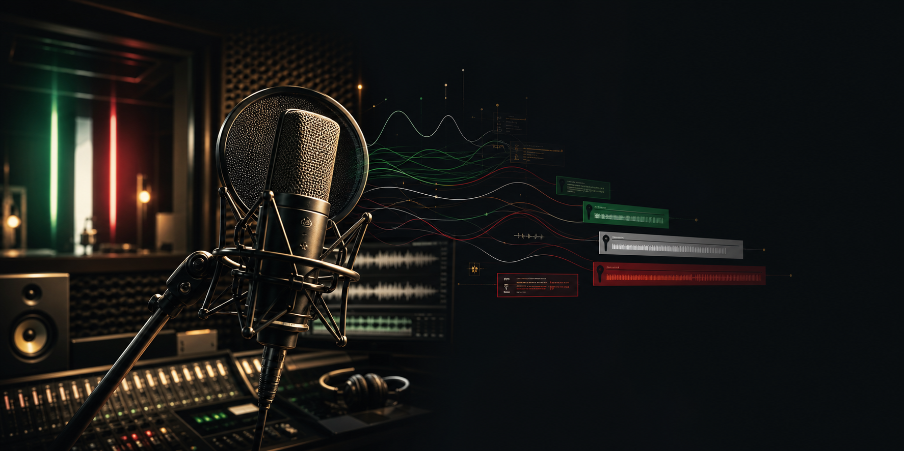

# 007 First Light - Doppiaggio Italiano AI Source-First v0.1



Versione `0.1` del doppiaggio italiano source-first per 007 First Light.

## Stato

- Audio patchati: `4505/16255` = `27.71%`.
- Mancanti: `11750`.
- Bond: `393/715`.
- Asset generati inclusi: `4505` WEM, `69.75 MB`.

La tabella completa per personaggio e in [`docs/progress_by_character.md`](docs/progress_by_character.md).

## Installazione

1. Chiudi il gioco.
2. Apri PowerShell nella cartella del mod.
3. Esegui:

```powershell
Set-ExecutionPolicy -Scope Process Bypass
.\install.ps1 -GamePath "C:\Program Files (x86)\Steam\steamapps\common\007 First Light"
```

Lo script crea un backup locale in `backups/` prima di modificare `Runtime\chunk0.rpkg` e `Runtime\chunk1.rpkg`.

## Disinstallazione

```powershell
Set-ExecutionPolicy -Scope Process Bypass
.\uninstall.ps1
```

Ripristina l'ultimo backup creato dall'installer.

## Metodo reale

Questa mod non usa one-shot clone diretto di ogni battuta originale. La pipeline usa una voce target approvata per il personaggio e l'audio sorgente come autorita di recitazione: emozione, pause, respiro, tosse, urla, distanza, urgenza e timing.

Il testo italiano viene adattato quando serve per stare nel tempo disponibile. Ogni take promosso passa attraverso QA ASR, controllo parole richieste, controllo timing/performance, filtro semantico, mastering 48 kHz, Wwise Vorbis, preservazione marker, runtime safety e audit sottotitoli.

Perche a volte resta un lieve accento inglese: nei test, il polish dell'accento rovinava recitazione o timing. In v0.1 preferiamo preservare pathos e ritmo del source rispetto a forzare una dizione perfetta ma piatta.

Questa e una prima passata automatica pensata anche come pipeline riusabile per altri giochi: priorita a velocita, sicurezza e coerenza, poi raffinamento.

## Limiti noti

- Non e una localizzazione finale AAA rifinita a mano.
- Alcune voci possono avere lieve accento o enfasi non perfetta.
- Le righe non patchate restano in backlog per retake/repair.
- Non include file originali del gioco.

## QA locale

E stata creata anche una pagina locale di confronto `originale -> voce target senza patos -> source-first con patos`, ma non viene inclusa qui perche contiene audio sorgente originale del gioco.

Percorso locale:

```text
C:\Users\matte\Documents\Codex\2026-06-12\saresti-in-grado-di-creare-una\outputs\NoPathosVsSourceFirst_20260618_0852\index.html
```
